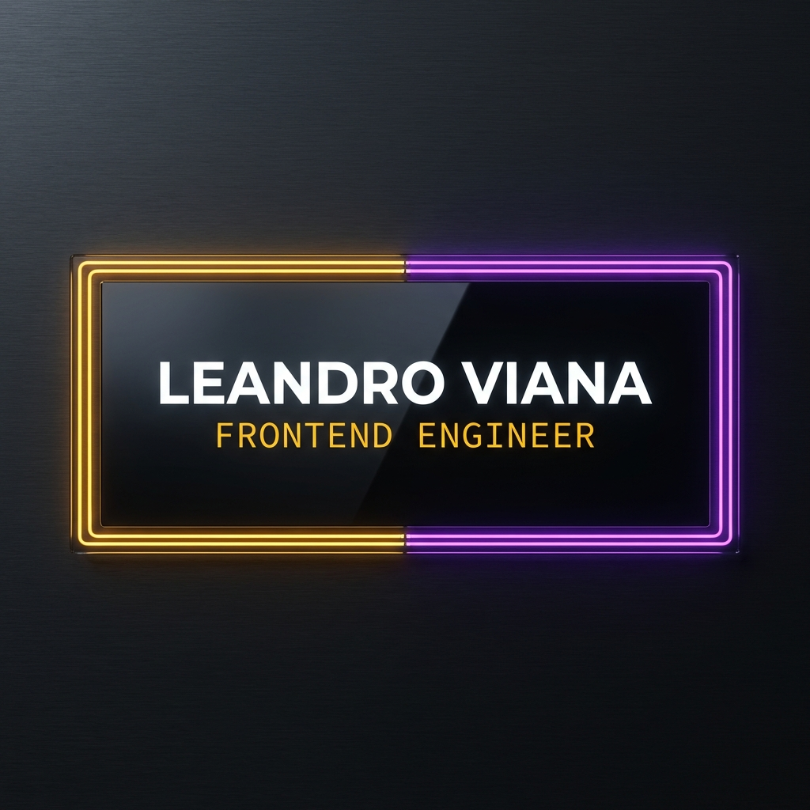

  
  
  

    
    
    
  

  

    <strong>Senior Frontend Architect & Software Engineer</strong> 
    <em>Orchestrating resilient digital ecosystems</em>
  

---

### [ 02 : EXPERTISE ]

> Building high-scale modular platforms with a focus on Frontend Architecture and Engineering Excellence.

*   **Role**: Senior Software Engineer at **CI&T**
*   **Education**: Information Systems Bachelor at **UFMS**

---

### [ 03 : MANIFEST ]

#### Languages & Core

  
  
  
  
  

#### Frameworks & Environments

  
  
  
  
  

#### Infrastructure & Tools

  
  
  
  
  

#### Databases & Systems

  
  
  

---

  
<em>The Universe is under no obligation to make sense to you.</em>

